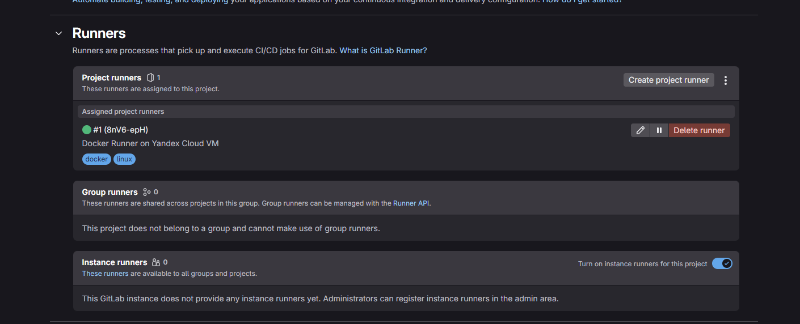
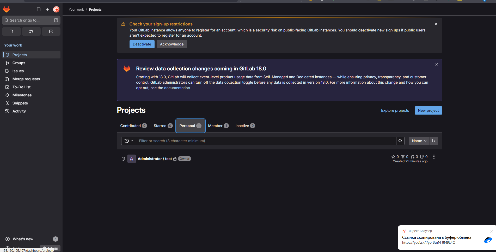
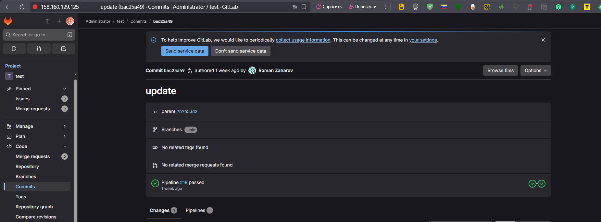

# Домашнее задание к занятию "CI/CD: GitLab"
### Выполнил: Захаров Роман

---

### Задание 1: Развертывание GitLab и регистрация Runner

**Цель:** Развернуть GitLab на облачной ВМ, создать проект и зарегистрировать для него Runner с Docker executor.

**Процесс выполнения:**
1.  В Yandex.Cloud была создана ВМ на базе Ubuntu 22.04 LTS (4 vCPU, 8 GB RAM, 40 GB SSD).
2.  На ВМ был установлен GitLab CE с помощью официального скрипта.
3.  После установки был получен пароль `root` и произведен вход в веб-интерфейс.
4.  В GitLab был создан новый приватный проект.
5.  На ту же ВМ был установлен GitLab Runner и Docker.
6.  Runner был успешно зарегистрирован для проекта с использованием `docker` executor и тегов `docker, linux`.


#### Скриншот с настройками Runner в проекте:





### Задание 2: Создание CI/CD пайплайна

**Цель:** Настроить CI/CD пайплайн для Go-приложения, который включает этапы тестирования и сборки Docker-образа с последующей публикацией в GitLab Container Registry.

**Процесс выполнения:**
1.  Локально был подготовлен Git-репозиторий с исходным кодом Go-приложения и `Dockerfile`.
2.  Удаленный `origin` репозитория был изменен на URL проекта в развернутом GitLab.
3.  Код был успешно отправлен (`git push`) на GitLab сервер.
4.  Был создан и добавлен в репозиторий файл `.gitlab-ci.yml`, описывающий два этапа: `test` и `build`.
5.  После `git push` файла `.gitlab-ci.yml` был автоматически запущен пайплайн, который успешно завершился.





#### Файл `.gitlab-ci.yml` для проекта:

```yaml
stages:
  - test
  - build

variables:
  IMAGE_NAME: $CI_REGISTRY_IMAGE:$CI_COMMIT_REF_SLUG

unit_tests:
  stage: test
  image: golang:1.22
  script:
    - echo "Running unit tests..."
    - go test .
  tags:
    - docker
    - linux

build_image:
  stage: build
  image: docker:20.10.16
  services:
    - name: docker:20.10.16-dind
      command: ["--insecure-registry=158.160.195.197:5050"] # IP-адрес GitLab сервера
  before_script:
    - until docker info; do sleep 1; done
    - docker login -u $CI_REGISTRY_USER -p $CI_REGISTRY_PASSWORD $CI_REGISTRY
  script:
    - echo "Building Docker image..."
    - docker build -t $IMAGE_NAME .
    - echo "Pushing Docker image to GitLab Container Registry..."
    - docker push $IMAGE_NAME
  tags:
    - docker
    - linux


   